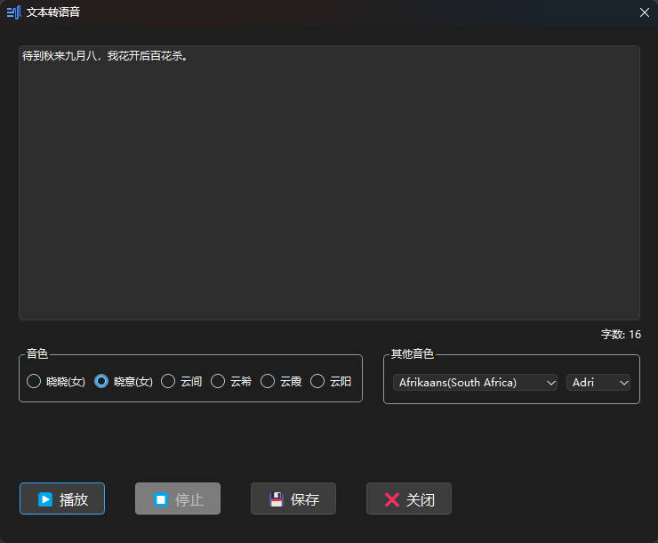

# edge-tts-gui
一个简单的edge-tts的GUI，无需安装任何依赖项，只需下载压缩包解压，并运行可执行文件即可。

快捷键：
- `Ctrl` + `Enter`：播放
- `Ctrl` + `S`：保存

全局快捷键：
- `F9`：快速转换（转换光标选中文本）

reference: [edge-tts](https://github.com/rany2/edge-tts)