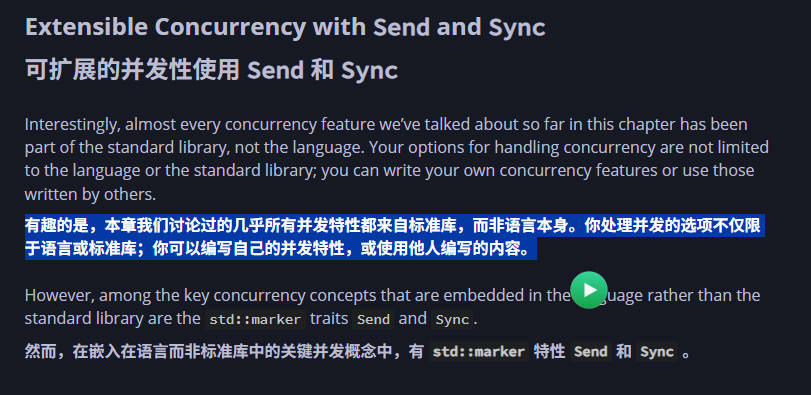

# edge-tts-gui
一个简单的edge-tts的GUI，无需安装任何依赖项，只需下载可执行文件即可。

新版本支持GPT-SoVITS api_v2

新版本支持 Qwen3-TTS-Flash（DashScope）：
- 先配置环境变量 `DASHSCOPE_API_KEY`
- 可选：`DASHSCOPE_BASE_HTTP_API_URL`（默认北京 `https://dashscope.aliyuncs.com/api/v1`，新加坡可用 `https://dashscope-intl.aliyuncs.com/api/v1`）
- 可选：`DASHSCOPE_TTS_ENDPOINT`（默认 `/services/aigc/multimodal-conversation/generation`）
- 可选：`DASHSCOPE_TTS_MODEL`（默认 `qwen3-tts-flash`）

快捷键：
- `Ctrl` + `Enter`：播放
- `Ctrl` + `S`：保存

全局快捷键：
- `F9`：快速朗读选中文本（或已截图片）

便捷操作：
- 选中文本后，在选中文本末尾会出现悬浮播放按钮，点击即可朗读（同 `F9` 效果）；朗读中按钮会变为停止，点击可停止

reference: 
- [edge-tts](https://github.com/rany2/edge-tts)
- [chineseocr_lite](https://github.com/DayBreak-u/chineseocr_lite)
- [GPT-SoVITS](https://github.com/RVC-Boss/GPT-SoVITS)
